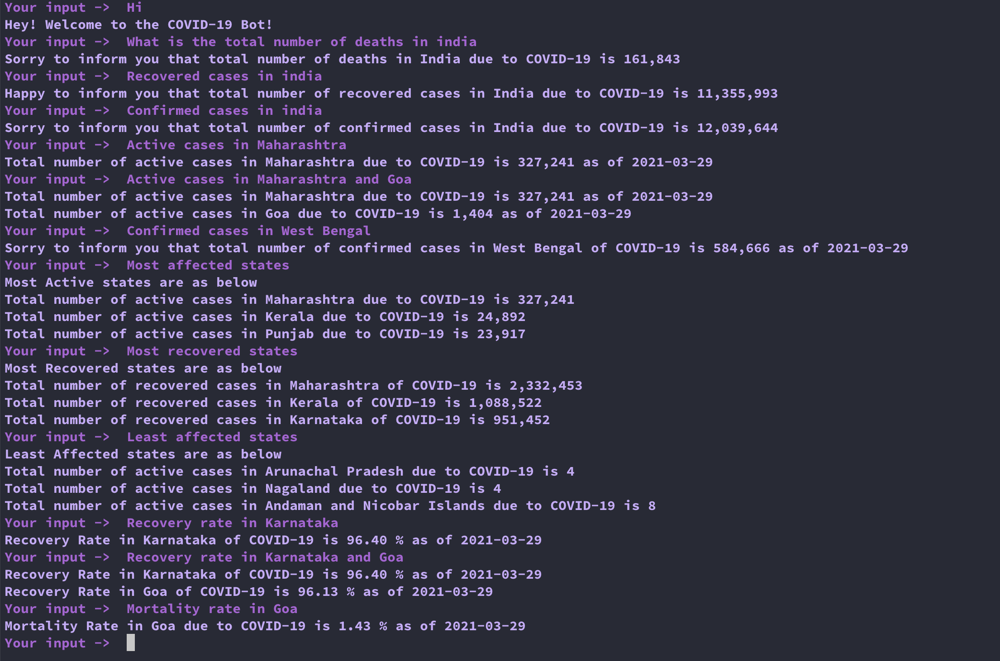
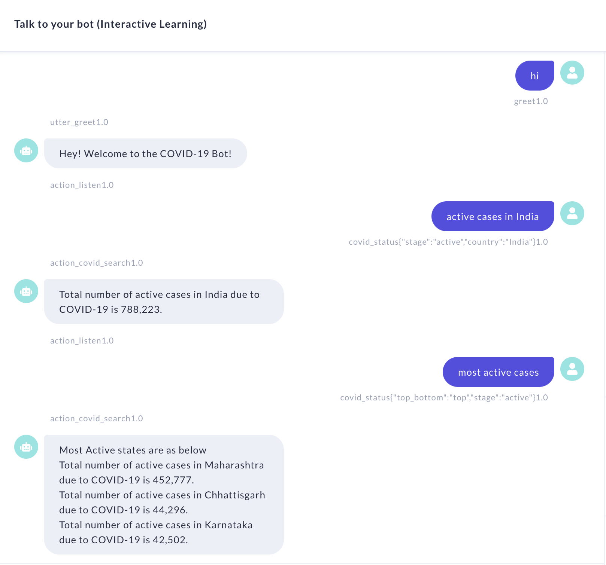
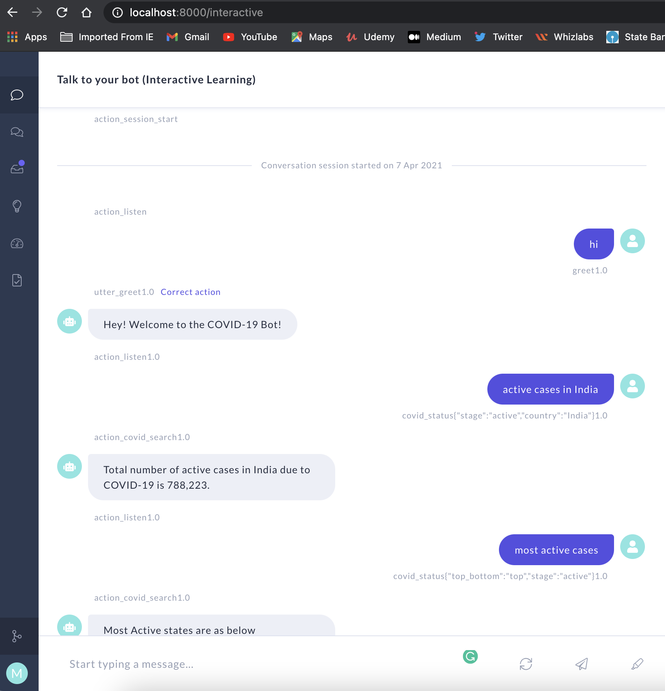

# COVID-19 Bot

This is an open source bot for querying information about **Novel Coronavirus (COVID-19)**.

<!-- TABLE OF CONTENTS -->
<details open="open">
  <summary>Table of Contents</summary>
  <ol>
    <li>
      <a href="#about-the-project">About The Project</a>
      <ul>
        <li><a href="#built-with">Built With</a></li>
      </ul>
    </li>
    <li>
      <a href="#getting-started">Getting Started</a>
      <ul>
        <li><a href="#prerequisites">Prerequisites</a></li>
        <li><a href="#installation">Installation</a></li>
      </ul>
    </li>
    <li><a href="#usage">Usage</a></li>
    <li><a href="#acknowledgements">Acknowledgements</a></li>
  </ol>
</details>

<!-- ABOUT THE PROJECT -->

## About The Project

This is an open source bot for querying information about **Novel Coronavirus (COVID-19)**.



The data mainly comes from [M-Media-Group/Covid-19-API](https://github.com/M-Media-Group/Covid-19-API) repository.

## Features

Currently, the Bot considers India and the states within.</br>
It has the below features.</br>

- Answer questions related COVID-19.
  - What is the total number of deaths in india
  - Recovered cases in india
  - Confirmed cases in india
  - Active cases in Maharashtra
  - Active cases in Maharashtra and Goa
  - Confirmed cases in West Bengal
  - Most affected states
  - Most recovered states
  - Least affected states
  - Recovery rate in Karnataka
  - Recovery rate in Karnataka and Goa
  - Mortality rate in Goa
- Handle spelling mistakes using custom Spellchecker.

- Answer questions related to vaccination status.

  - patial vaccinated people in India
  - people fully vaccinated in India

- Handle out of context questions.

- RASA-X for Interactive training.

### Built With

- [Rasa : 2.0.2 ](https://rasa.com/docs/rasa/)
- [Python : 3.8 ](https://www.python.org/)
- [Rasa-SDK Action Server : 2.4.0 ](https://rasa.com/docs/action-server)

<!-- GETTING STARTED -->

## Getting Started

### Prerequisites

- Python
- [Pipenv](https://pypi.org/project/pipenv/)
- [Docker](https://docs.docker.com/engine/install/)
- [Helm](https://helm.sh/docs/intro/install/)
- [Kubernested](https://kubernetes.io/docs/setup/)

### Installation

- Clone the repository

  ```
  git clone https://github.com/sumanentc/COVID-19-bot.git
  ```

- Using RASA Shell and Stand alone Action Server

  1. Install dependencies

  ```
  pipenv shell

  pipenv install
  ```

  2. Train the model

  ```
  rasa train

  ```

  3. Start the Action Server

  ```
  rasa run actions

  ```

  4. Start the RASA shell

  ```
  rasa shell
  ```

  5. Start asking questions on the RASA shell

- Using RASA-X

  1. Build Action Server Docker image

  ```
  docker build actions/ -t sumand/rasa-action-server:2.4.0

  docker push sumand/rasa-action-server:2.4.0

  ```

  2. Build Rasa NLU Docker image

  ```
  docker build . -t sumand/rasa-server:2.0.2

  docker push sumand/rasa-server:2.0.2
  ```

  3. Install RASA-X. I used [Helm-Chart](https://rasa.com/docs/rasa-x/installation-and-setup/install/helm-chart) for installation.

  ```
  kubectl create namespace rasa

  helm repo add rasa-x https://rasahq.github.io/rasa-x-helm

  helm --namespace rasa install --values values.yml my-release rasa-x/rasa-x

  helm --namespace rasa upgrade --values values.yml my-release rasa-x/rasa-x
  ```

  4. Deploy [RASA-X](https://rasa.com/docs/rasa-x/installation-and-setup/deploy)

<!-- USAGE EXAMPLES -->

## Usage

1. Use RASA Shell to test the Bot.

```
rasa shell
```

2. Use RASA-X to test the Bot.
   

<!-- ACKNOWLEDGEMENTS -->

## Acknowledgements

- [M-Media-Group/Covid-19-API](https://github.com/M-Media-Group/Covid-19-API)
- [Install RASA-X using Helm Chart](https://rasa.com/docs/rasa-x/installation-and-setup/install/helm-chart/)
